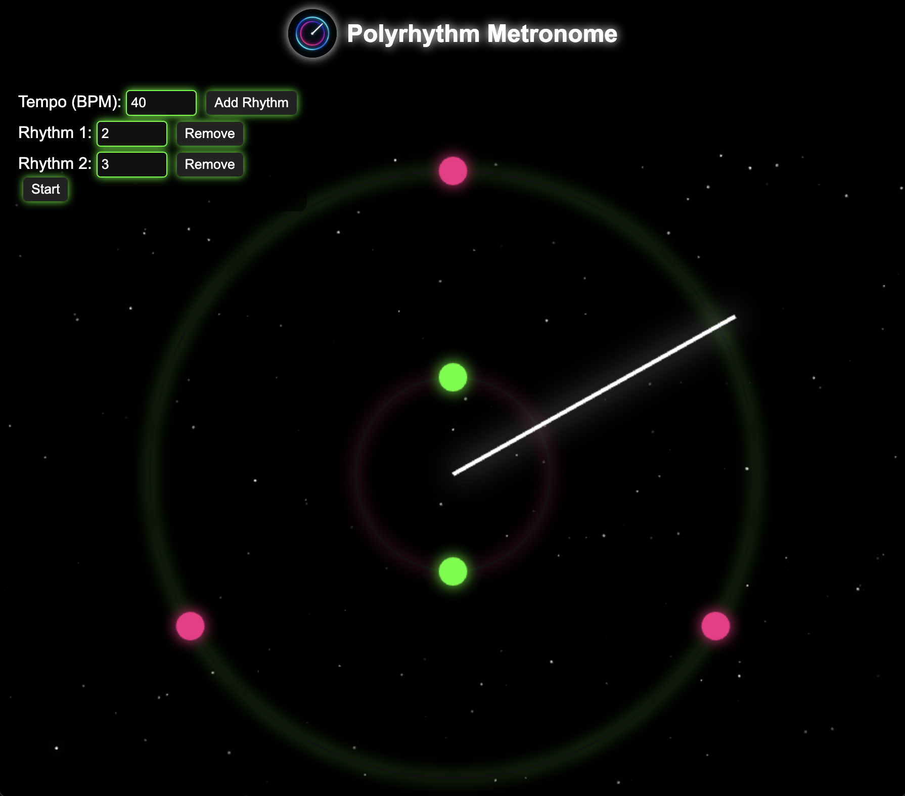
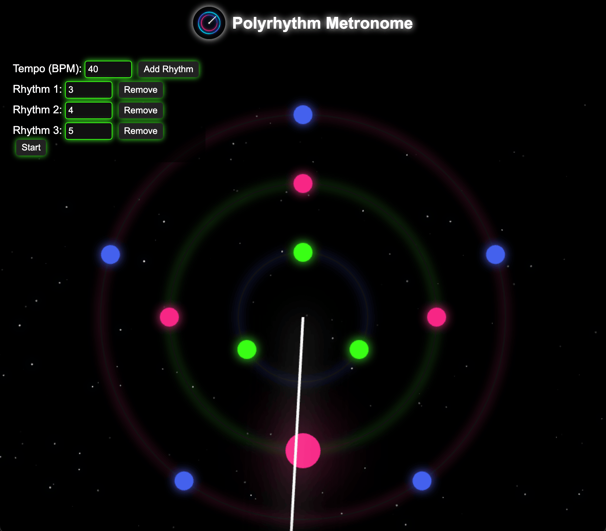

# Polyrhythm Metronome 🎵

A polyrhythm metronome website. Add, remove, or customize different polyrhythms
using the neon-themed clock interface with the beats showing up as circles on the orbit and 
synced audio.

 

  
  

 

---

## Website

You can try the metronome here:  
👉 [https://Karan5352.github.io/polyrhythm-website/](https://Karan5352.github.io/polyrhythm-website/)

---

## Features

 - Clock style circular metronome with multiple orbits for different rhythms
 - Adjustable BPM and polyrhythms (i.e., 3:4, 2:3:8)
 - Visual pulses synchronized with beats
 - Distinct sounds for each rhythm

---
